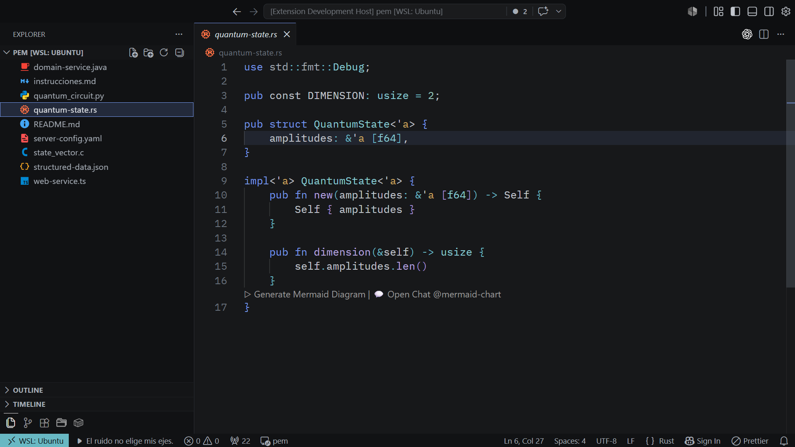
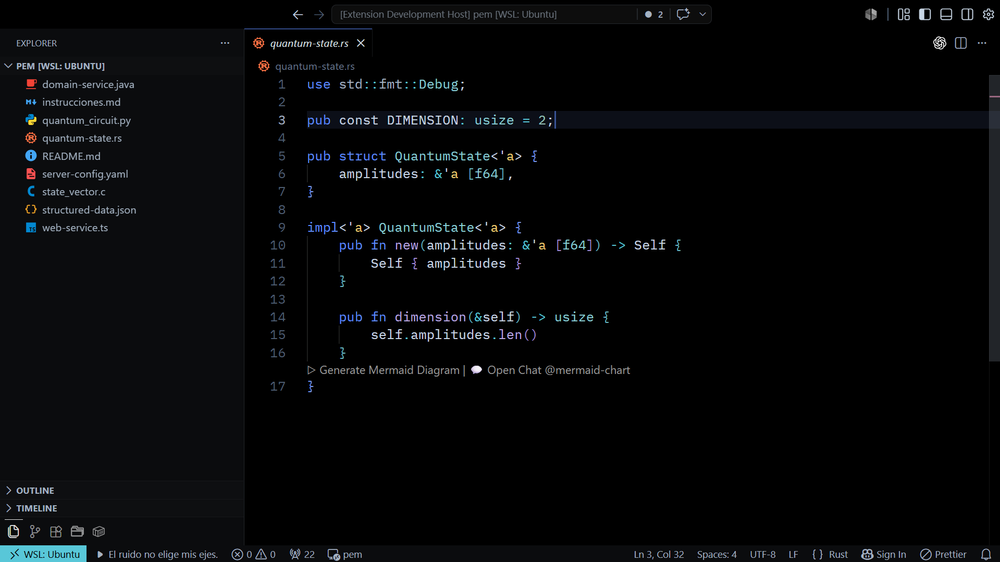
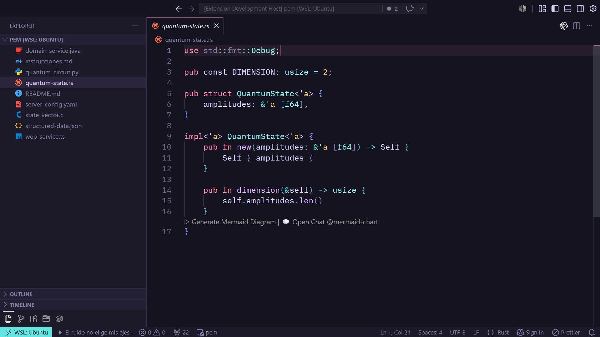
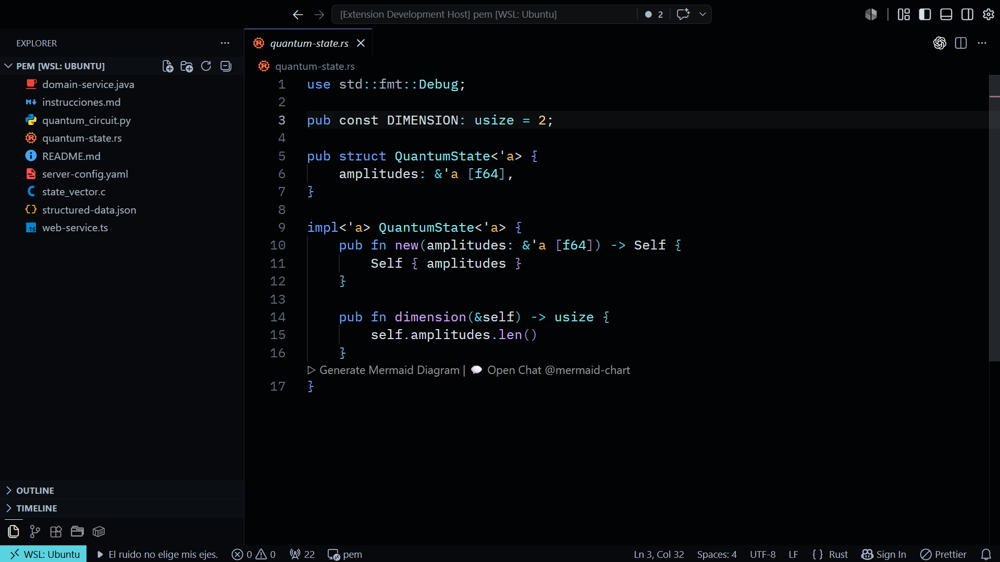

# Eliejesresce K2 Themes

A family of dark Visual Studio Code themes designed around semantic clarity,
controlled contrast, and long coding sessions.

The collection contains four distinct interpretations of the same K2 visual
language.

## Themes

### K2 Coherence

Balanced, technical, and restrained. The default expression of the K2 palette.



### K2 Vacuum

A deeper and quieter variation built around near-black surfaces and cool accents.



### K2 Dim

The expressive member of the family: intense pastel colors over an indigo-plum
background.



### K2 Endurance

A high-contrast dark theme designed for clear navigation during long development
sessions.



## Design language

K2 uses semantic color roles rather than assigning arbitrary colors to individual
languages:

- **Blue** represents direction and control.
- **Cyan** represents structure and types.
- **Violet** represents transformation and behavior.
- **Green** represents valid data.
- **Amber** represents attention and constants.
- **Coral** represents errors and rupture.
- **Neutral tones** carry ordinary variables and contextual information.

Each theme reinterprets these roles while preserving a consistent reading model.

## Language coverage

The themes include dedicated coverage for:

- Python and Qiskit
- TypeScript and JavaScript
- Java
- Rust
- C
- HTML and Django templates
- CSS
- JSON
- YAML
- Markdown
- Terminal ANSI colors
- Diagnostics, diffs, debugging, testing and notebooks

## Installation

### Visual Studio Code Marketplace

1. Open **Extensions** in Visual Studio Code.
2. Search for `Eliejesresce K2 Themes`.
3. Install the extension.
4. Open `Preferences: Color Theme`.
5. Select one of the K2 themes.

### Local VSIX

```bash
code --install-extension eliejesresce-k2-theme-3.0.0.vsix
```

## Development

Install dependencies:

```bash
npm install
```

Validate the token architecture:

```bash
npm run validate
```

Generate all themes:

```bash
npm run build
```

Check that generated files are synchronized:

```bash
npm run check:themes
```

Run the complete test suite:

```bash
npm test
```

Generate a contrast report:

```bash
npm run report:contrast
```

Package the extension:

```bash
npx @vscode/vsce package
```

## Architecture

The generated themes are built from:

```text
Primitive palette
        ↓
Semantic roles
        ↓
Shared components
        ↓
Variant overrides
        ↓
VS Code theme files
```

Raw colors are restricted to the primitive palette. The build validates token
references, required surfaces, deterministic output, and contrast contracts.

## License

MIT © 2026 Juan Diego Guerrero Camargo